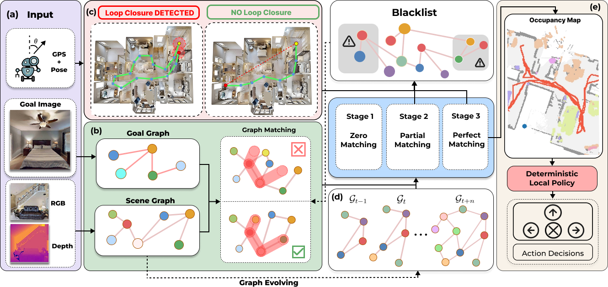

# T²-Nav: Algebraic-Topology Aware Temporal Graph Memory and Loop Detection for Zero-Shot Visual Navigation  

This repository contains the **T²-Nav** implementation, built on top of [UniGoal](https://github.com/bagh2178/UniGoal).  
Our method introduces two new modules and a wrapped Agent class to extend UniGoal for **zero-shot visual navigation with topology-aware temporal memory and loop detection**.  

This codebase is released as part of our ICRA 2026 submission:  
**T²-Nav: Algebraic-Topology Aware Temporal Graph Memory and Loop Detection for Zero-Shot Visual Navigation**.  

---
## Demo

[


## Method 

Method Pipeline:



## Installation  

1. Install dependencies:
  ```bash
  git clone https://github.com/cogniboticslab/t2nav.git
  cd t2nav
  conda create -n T2Nav python=3.8
  conda activate T2Nav
  pip install -r requirements.txt
  ```

2. Clone the UniGoal baseline repository:  
```bash
git clone https://github.com/bagh2178/UniGoal.git
cd UniGoal
```

## 📂 Dataset Preparation
Download links

Scene dataset (HM3D v0.2): [Download Link](https://api.matterport.com/resources/habitat/hm3d-val-habitat-v0.2.tar)

Instance Image Goal dataset: [Download Link](https://dl.fbaipublicfiles.com/habitat/data/datasets/imagenav/hm3d/v3/instance_imagenav_hm3d_v3.zip) 

Unpack both into the directory, the folder structure should follow:
   ```bash
  .../
  └── data/
      ├── datasets/
      │   └── instance_imagenav/
      │       └── hm3d/
      │           └── v3/
      │               └── val/
      │                   ├── content/
      │                   │   ├── 4ok3usBNeis.json.gz
      │                   │   ├── 5cdEh9F2hJL.json.gz
      │                   │   └── ...
      │                   └── val.json.gz
      └── scene_datasets/
          └── hm3d_v0.2/
              └── val/
                  ├── 00800-TEEsavR23oF/
                  │   ├── TEEsavR23oF.basis.glb
                  │   └── TEEsavR23oF.basis.navmesh
                  ├── 00801-HaxA7YrQdEC/
                  └── ...
                  └── 00899-58NLZxWBSpk/
  ```

## 🧩 Code Structure  

This repo contributes **3 files** on top of UniGoal:  

- **Module 1** - Temporal Reasoning Memory Module (TeRM).
- **Module 2** - Topological Signatures for Loop Closure (TSLC).  
- **Agent Wrapper** – T²-Nav Agent, integrating the above with UniGoal’s navigation policy.

## ▶️ Running Experiments

After preparing data and replacing files, you can run evaluation as:
```bash
python main.py --goal_type ins-image --config-file configs/t2nav.yaml
```

## 📜 Citation

If you find this work useful, please consider citing:
```bibtex
@inproceedings{t2nav_icra2026,
  title     = {T2-Nav: Algebraic-TopologyAware Temporal Graph Memory and Loop Detection for Zero-Shot Visual Navigation},
  author    = {},
  booktitle = {IEEE International Conference on Robotics and Automation (ICRA)},
  year      = {2026},
  note      = {Under Review},
  url       = {https://github.com/cogniboticslab/t2nav}
}
```
